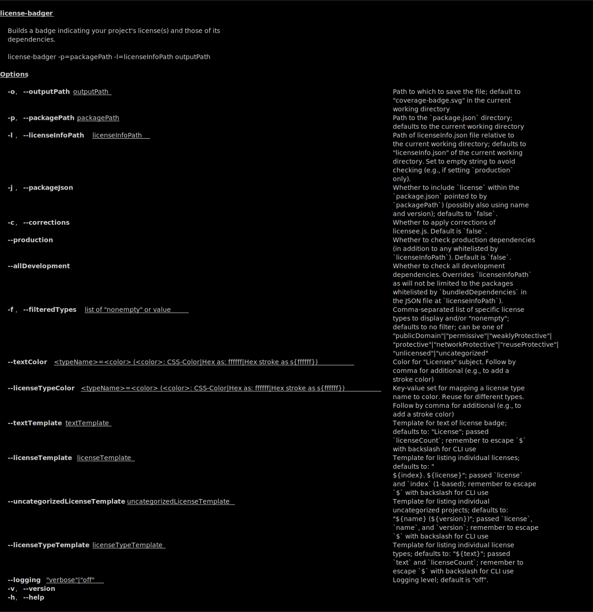

# license-badger

**This project is in early alpha.**

<!--
Build a badge indicating your project's license(s) and those of its dependencies.

## Installation

```
npm i license-badger
```

## Usage

```sh
license-badger  --filteredTypes=weaklyProtective,protective --textTemplate \"License types (\\${licenseCount})\" --licenseTypeColor networkProtective=blue,s{white} -l test/fixtures/licenseInfo.json test.svg
```
-->

Adopts helpful categories of [npm-consider](https://github.com/delfrrr/npm-consider):
"publicDomain", "permissive", "weaklyProtective", "protective", "networkProtective",
and "uncategorized". We also add "reuseProtective" (for
[RPL](https://en.wikipedia.org/wiki/Reciprocal_Public_License) and
[Parity](https://licensezero.com/licenses/parity) type licenses which put
conditions on even private use) and "unlicensed" (which is copyrighted or
otherwise explicitly against reuse--rather than merely being currently
unspecified).
<!--
(See [#24](https://github.com/delfrrr/npm-consider/issues/24) and [#18](https://github.com/delfrrr/npm-consider/issues/18#issuecomment-568872477) of `npm-consider` for tracking these recommendations)
-->

## CLI



## See also

- [mocha-badge-generator](https://github.com/ianpogi5/mocha-badge-generator) - Locally created badges for Mocha test results
- [coveradge](https://github.com/brettz9/coveradge) - Locally-created badges for nyc/istanbul coverage

## Immediate to-dos

1. Fix `uncategorized`
1. Ability to merge license types from self, deps, devDeps, and optionally
    specific packages

## To-dos

1. Document above
1. Process `licenseeInfo.json` `filesByLicense` to overwrite `license`
    in `package.json`
    1. Extract jsdoc iterator from `eslint-plugin-jsdoc` to own repo and
        use to search for `@license` within files so as to be able to
        overwrite `filesByLicense` with dynamic info
1. Generate reports (MD, HTML, JSON, CLI) creating a
    `bundledPackagesByLicense` (and repeating `filesByLicense` info), and
    using `licenseeInfo.json`'s `bundledRootPackages` (and optionally
    `default`)
    1. Use `unapproved`, `nonApproved`, and especially `manuallyCorrected`
        info in reports so users can know whether to report.
    1. Link to issue tracker and/or search of issue tracker for "license",
        so users can easily see if filed/discussed, at least for those
        missing, manually corrected, etc.
1. See about using [license-checker](https://github.com/davglass/license-checker)
    for more detection opportunities (e.g., README and License file); see
    also <https://github.com/davglass/license-checker/issues/225> to make this
    easier on our end.
