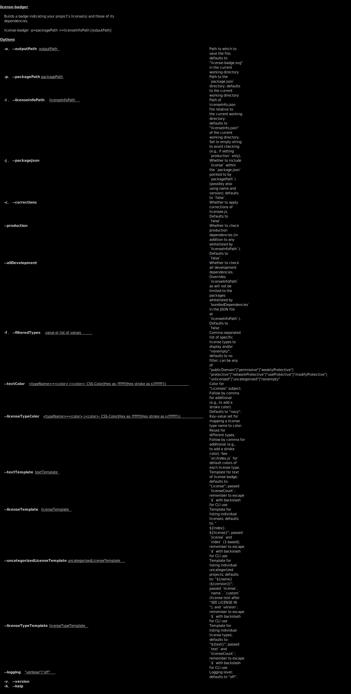

# license-badger

**This project is not yet functional**

<!--
Build a badge indicating your project's license(s) and those of its dependencies.

## Installation

```
npm i license-badger
```

-->

Adopts helpful categories of [npm-consider](https://github.com/delfrrr/npm-consider):
"publicDomain", "permissive", "weaklyProtective", "protective", "networkProtective",
and "uncategorized". We also add "reuseProtective" (for
[RPL](https://en.wikipedia.org/wiki/Reciprocal_Public_License) and
[Parity](https://licensezero.com/licenses/parity) type licenses which put
conditions on even private use) and "unlicensed" (which is copyrighted or
otherwise explicitly against reuse--rather than merely being currently
unspecified).
<!--
(See [#24](https://github.com/delfrrr/npm-consider/issues/24) and [#18](https://github.com/delfrrr/npm-consider/issues/18#issuecomment-568872477) of `npm-consider` for tracking these recommendations)
-->

## CLI



## Immediate to-dos

1. Make general purpose
